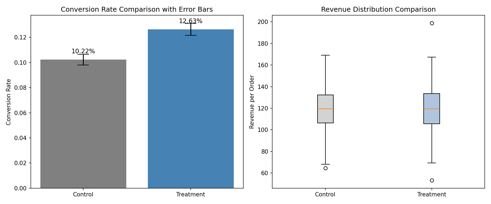

# A/B Testing for E-commerce Promotion

模拟某电商 APP 进行“满 100 减 20”优惠券的 A/B 测试，通过统计检验评估策略对转化率和客单价的影响。

## 技术栈
Python | Pandas | NumPy | SciPy | StatsModels | Matplotlib | 统计假设检验

## 实验设计
- **对照组 (Control)**：未收到优惠券
- **实验组 (Treatment)**：收到“满 100 减 20”优惠券
- 每组随机分配约 5000 名用户
- 实验指标：订单转化率、客单价

## 统计方法
- **转化率**：双样本比例 Z 检验（`proportions_ztest`）
- **客单价**：独立样本 T 检验（Welch's t-test）
- 置信水平：α = 0.05

## 分析结果
- 实验组转化率显著高于对照组 (p < 0.05)，优惠券提升了约 2.4 个百分点的转化率
- 客单价无显著差异 (p > 0.05)，优惠券未影响用户消费金额
- 建议全量上线优惠券，并持续监控客单价变化

## 可视化

## 项目结构
